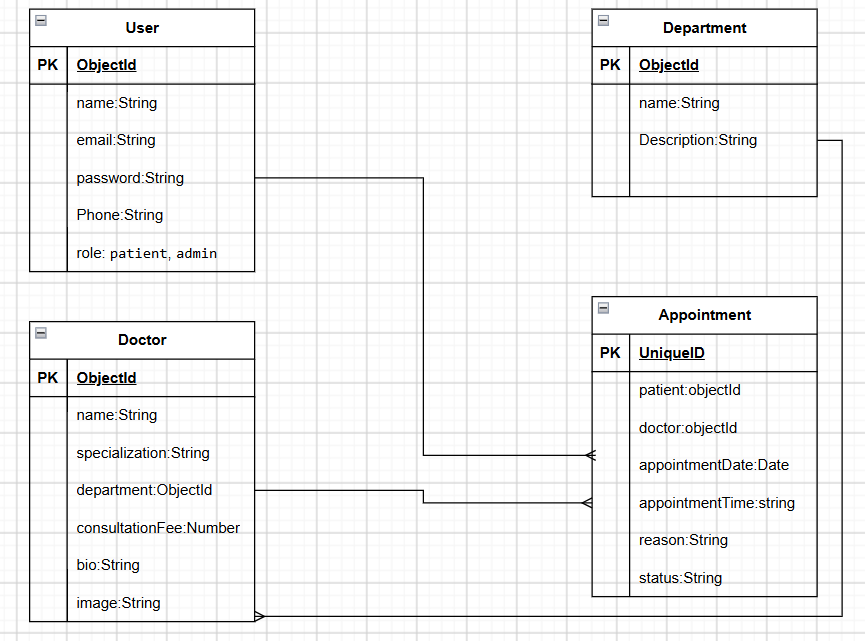

# Project Name

NOBATI

## Overview

NOBATI is a clinic appointment management system that allows patients to find doctors and manage their appointments online.

The platform connects patients, doctors, departments, and appointments in one simple system.

The name **NOBATI** means **"My Turn"**, representing the idea of organizing appointments and patient queues.

## Screenshots

## Technologies Used

## Getting Started

## User Stories

### Patient
- As a patient, I want to register and log in.
- As a patient, I want to view and search for doctors.
- As a patient, I want to book an appointment.
- As a patient, I want to view and manage my appointments.

### Doctor
- As a doctor, I want to log in.
- As a doctor, I want to view my appointments.
- As a doctor, I want to update the status of appointments.

### Admin
- As an admin, I want to manage doctors.
- As an admin, I want to manage departments.
- As an admin, I want to manage appointments.
- As an admin, I want to view registered users.

## Database Design

## Routes

| Method | Route | Description |
|--------|-------|-------------|

## Features

## Future Enhancements

## Credits