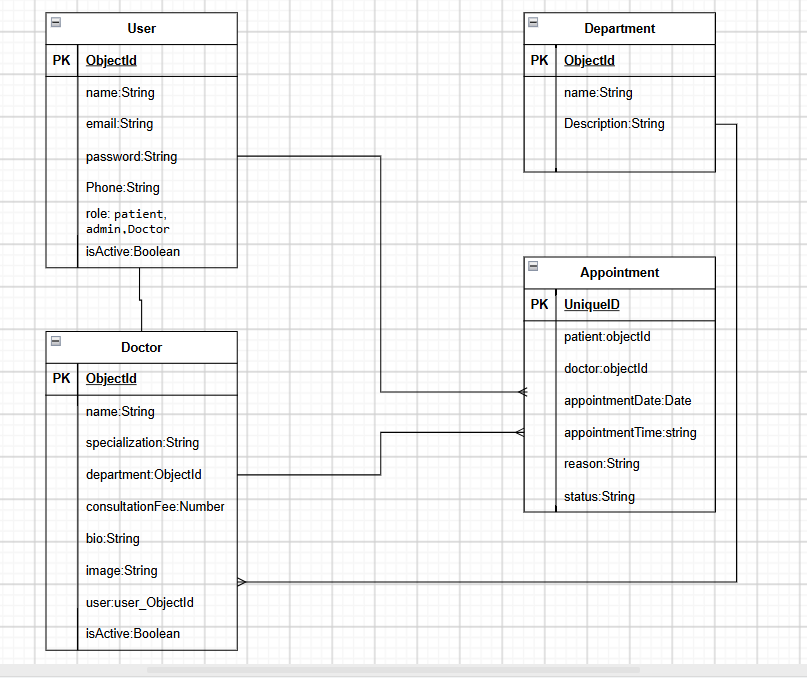

# Project Name

 NOBATI

## Overview

NOBATI is a clinic appointment management system designed to connect patients, doctors, departments, and appointments in one simple platform.

Patients can create accounts, explore doctors and departments, book appointments, and manage their appointments online.

Doctors can manage their profiles and assigned appointments, while administrators can manage patients, doctors, departments, and appointments.

The name **NOBATI** means **"My Turn"**, representing the idea of organizing clinic appointments and patient turns.

## Screenshots

## Patient role Screen Shot


## Technologies Used

- Node.js
- Express.js
- EJS
- MongoDB
- Mongoose
- Express Session
- MongoDB Session Storage
- bcrypt
- Multer
- method-override
- Morgan
- Bootstrap Icons
- HTML
- CSS

## Getting Started

1. Clone the repository.

```bash
git clone https://github.com/Mohamed-ABannai/Project2-NOBATI.git
```

2. Enter the project directory.

```bash
cd Project2-NOBATI
```

3. Install the required dependencies.

```bash
npm install
```

4. Create a `.env` file in the project root.

```bash
touch .env
```

5. Add the required environment variables to the `.env` file.

```env
MONGODB_URI=your_mongodb_connection_string
SESSION_SECRET=your_session_secret
PORT=3000
```

6. Make sure your MongoDB database is running and the `MONGODB_URI` is connected to your database.

7. Start the application.

```bash
nodemon server.js
```

8. Open the application in your browser.

```text
http://localhost:3000
```

## User Stories

### Patient

- As a patient, I want to create an account and sign in.
- As a patient, I want to view available doctors.
- As a patient, I want to view medical departments.
- As a patient, I want to book an appointment.
- As a patient, I want to view my appointments.
- As a patient, I want to edit my appointment details.
- As a patient, I want to cancel an appointment.

### Doctor

- As a doctor, I want to sign in to my account.
- As a doctor, I want to view and update my profile.
- As a doctor, I want to view appointments assigned to me.
- As a doctor, I want to confirm pending appointments.
- As a doctor, I want to cancel appointments.
- As a doctor, I want to mark confirmed appointments as completed.
- As a doctor, I want to redirect a completed appointment to another doctor with a new date and time.
- As a doctor, I want to view doctors and departments.

### Admin

- As an admin, I want to access an admin dashboard.
- As an admin, I want to view and manage patient accounts.
- As an admin, I want to activate or deactivate patient accounts.
- As an admin, I want to create and manage doctors.
- As an admin, I want to deactivate doctor accounts.
- As an admin, I want to create, edit, and delete departments.
- As an admin, I want to view all appointments.
- As an admin, I want to update appointment dates.
- As an admin, I want to cancel appointments.

## Database Design



## Routes

### General Routes

| Method | Route | Description |
| --- | --- | --- |
| GET | `/` | Display the homepage for guests and patients or redirect doctors and admins to their dashboards. |

### Authentication Routes

| Method | Route | Description |
| --- | --- | --- |
| GET | `/auth/sign-up` | Display the registration form. |
| POST | `/auth/sign-up` | Create a new user account. |
| GET | `/auth/sign-in` | Display the sign-in form. |
| POST | `/auth/sign-in` | Authenticate the user and redirect based on their role. |
| GET | `/auth/sign-out` | Destroy the current session and sign the user out. |

### Patient Appointment Routes

| Method | Route | Description |
| --- | --- | --- |
| GET | `/appointment` | Display the signed-in patient's appointments. |
| GET | `/appointment/new` | Display the appointment booking form. |
| POST | `/appointment/new` | Create a new appointment. |
| GET | `/appointment/:id/edit` | Display the appointment update form. |
| PUT | `/appointment/:id` | Update the doctor, date, time, and reason of an appointment. |
| PUT | `/appointment/:id/cancel` | Cancel an appointment. |

### Doctor Profile Routes

| Method | Route | Description |
| --- | --- | --- |
| GET | `/doctor` | Display the doctor dashboard. |
| GET | `/doctor/edit` | Display the signed-in doctor's profile update form. |
| PUT | `/doctor/profile` | Update the signed-in doctor's account and professional information. |

### Doctor Appointment Routes

| Method | Route | Description |
| --- | --- | --- |
| GET | `/doctor/appointments` | Display appointments assigned to the signed-in doctor. |
| PUT | `/doctor/appointments/:id/confirm` | Confirm a pending appointment. |
| PUT | `/doctor/appointments/:id/cancel` | Cancel an assigned appointment. |
| PUT | `/doctor/appointments/:id/complete` | Mark a confirmed appointment as completed. |
| GET | `/doctor/appointments/:id/redirect` | Display the appointment redirect form. |
| PUT | `/doctor/appointments/:id/redirect` | Redirect a completed appointment to another doctor with a new date and time. |

### Doctor Management Routes

| Method | Route | Description |
| --- | --- | --- |
| GET | `/doctor/allDoctors` | Display all active doctors to signed-in users. |
| GET | `/doctor/new` | Display the admin form for creating a doctor. |
| POST | `/doctor/new` | Create a doctor User account and Doctor profile. |
| GET | `/doctor/:id/edit` | Display the admin doctor update form. |
| PUT | `/doctor/:id` | Update a doctor's account and professional information. |
| DELETE | `/doctor/:id` | Deactivate the Doctor profile and associated User account. |

### Department Routes

| Method | Route | Description |
| --- | --- | --- |
| GET | `/departments` | Display all departments. |
| GET | `/departments/create` | Display the department creation form for admins. |
| POST | `/departments/create` | Create a new department. |
| GET | `/departments/:id/edit` | Display the department update form for admins. |
| PUT | `/departments/:id` | Update a department. |
| DELETE | `/departments/:id` | Delete a department. |

### Admin User Routes

| Method | Route | Description |
| --- | --- | --- |
| GET | `/admin` | Display the admin dashboard. |
| GET | `/admin/AllUser` | Display registered patient accounts. |
| GET | `/admin/AllUser/:id/edit` | Display the patient account update form. |
| PUT | `/admin/AllUser/:id` | Update a patient's account information and active status. |
| DELETE | `/admin/AllUser/:id` | Deactivate a patient account. |

### Admin Appointment Routes

| Method | Route | Description |
| --- | --- | --- |
| GET | `/admin/appointments` | Display all appointments. |
| GET | `/admin/appointments/:id/edit` | Display the appointment date update form. |
| PUT | `/admin/appointments/:id` | Update an appointment date. |
| PUT | `/admin/appointments/:id/cancel` | Cancel an appointment. |

## Features

- User registration and authentication.
- Role-based access for patients, doctors, and admins.
- Password hashing using bcrypt.
- Session-based authentication.
- Active and inactive user accounts.
- Doctor profiles connected to User accounts.
- Doctor profile editing.
- Medical department management.
- Doctor image storage using Multer and MongoDB.
- Patient appointment booking.
- Patient appointment editing and cancellation.
- Appointment status management.
- Doctor appointment confirmation.
- Doctor appointment completion and cancellation.
- Appointment redirection between doctors.
- Admin patient management.
- Admin doctor management.
- Admin department management.
- Admin appointment management.
- Soft deletion for doctors and patient accounts using `isActive`.
- Custom 404 page.
- Role-based navigation.

## Future Enhancements

- Add appointment availability and time-slot validation to prevent double bookings.
- Add appointment search and filtering.
- Add email notifications for appointment updates.
- Add appointment reminders.
- Add patient profile management.
- Add doctor availability schedules.
- Add more medical departments and appointment booking options.
- Improve validation and error messages.
- Add an AI assistant to help patients find the appropriate department or doctor.
- Improve responsive design for mobile devices.

## Credits
Developed By Mohamed Abdulla 
NOBATI was developed with the support of research from online resources and official documentation throughout the planning and development process.